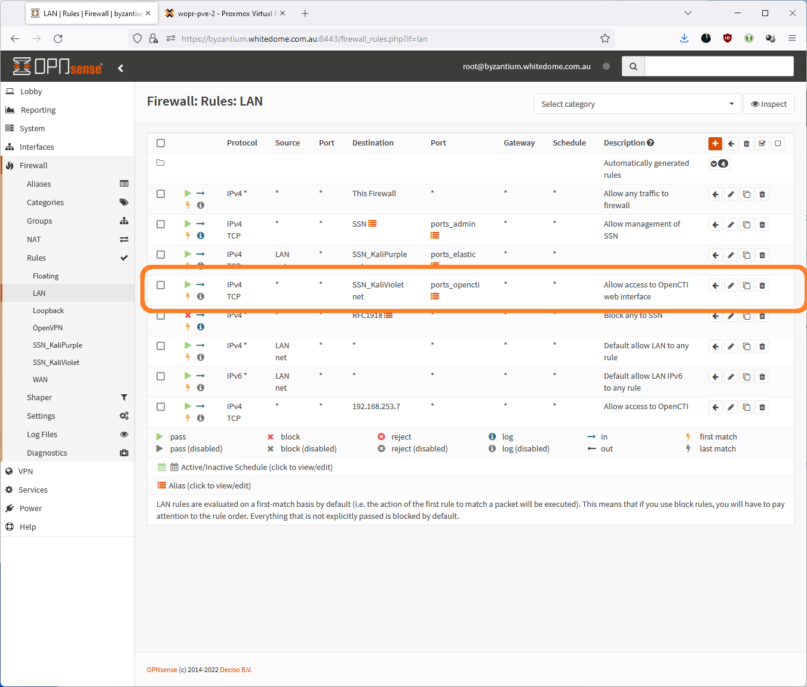

Installation:
--------------

# Define firewall rules to allow access from the LAN to Portainer and OpenCTI
# Create an alias:  
  

# Add firewall rule:  
  

# Install dependencies:

~~~~~~~~~~~~~~~~~~~~~~~~~~~~~~~~~
sudo apt update
sudo apt install curl
~~~~~~~~~~~~~~~~~~~~~~~~~~~~~~~~~

# Install docker

~~~~~~~~~~~~~~~~~~~~~~~~~~~~~~~~~
sudo apt install docker.io
sudo systemctl enable docker --now
~~~~~~~~~~~~~~~~~~~~~~~~~~~~~~~~~

# Manage docker as a non root user

~~~~~~~~~~~~~~~~~~~~~~~~~~~~~~~~~
sudo usermod -aG docker $USER
sudo chmod 666 /var/run/docker.sock
~~~~~~~~~~~~~~~~~~~~~~~~~~~~~~~~~

# Install Portainer

~~~~~~~~~~~~~~~~~~~~~~~~~~~~~~~~~
docker volume create portainer_data
docker run -d -p 18000:18000 -p 9443:9443 --name portainer --restart=always -v /var/run/docker.sock:/var/run/docker.sock -v portainer_data:/data portainer/portainer-ce:latest
~~~~~~~~~~~~~~~~~~~~~~~~~~~~~~~~~

# Check if container has been started

~~~~~~~~~~~~~~~~~~~~~~~~~~~~~~~~~
docker ps
~~~~~~~~~~~~~~~~~~~~~~~~~~~~~~~~~

# Log into portainer
https://kali-violet.kali.purple:9443  
  

# Install OpenCTI

(https://blog.agood.cloud/posts/2020/04/22/opencti-installation/)

Within Portainer, Select Stacks from the left hand pane, and Add stack. Give the stack a name (e.g. opencti) , and use the web editor to paste in the docker-compose.yml file from the OpenCTI github repository:
https://github.com/OpenCTI-Platform/docker/blob/master/docker-compose.yml  
  

**Before we deploy the stack we need to create a number of environment variables.  If you look at the docker-compose.yml file, you will notice a heap of ${VARIABLE} entries.  We can add these as Environment variables**  

Generate environmental variables:

~~~~~~~~~~~~~~~~~~~~~~~~~~~~~~~~~
sudo mkdir /opt/opencti
cd /opt/opencti

sudo bash -c "(cat << EOF
OPENCTI_ADMIN_EMAIL=admin@opencti.io
OPENCTI_BASE_URL=http://kali-violet.kali.purple:8080
OPENCTI_ADMIN_PASSWORD=CHANGEMEPLEASE
OPENCTI_ADMIN_TOKEN=$(cat /proc/sys/kernel/random/uuid)
MINIO_ROOT_USER=$(cat /proc/sys/kernel/random/uuid)
MINIO_ROOT_PASSWORD=$(cat /proc/sys/kernel/random/uuid)
RABBITMQ_DEFAULT_USER=opencti
RABBITMQ_DEFAULT_PASS=$(cat /proc/sys/kernel/random/uuid)
CONNECTOR_HISTORY_ID=$(cat /proc/sys/kernel/random/uuid)
CONNECTOR_EXPORT_FILE_STIX_ID=$(cat /proc/sys/kernel/random/uuid)
CONNECTOR_EXPORT_FILE_CSV_ID=$(cat /proc/sys/kernel/random/uuid)
CONNECTOR_EXPORT_FILE_TXT_ID=$(cat /proc/sys/kernel/random/uuid)
CONNECTOR_IMPORT_DOCUMENT_ID=$(cat /proc/sys/kernel/random/uuid)
CONNECTOR_IMPORT_FILE_STIX_ID=$(cat /proc/sys/kernel/random/uuid)
CONNECTOR_IMPORT_REPORT_ID=$(cat /proc/sys/kernel/random/uuid)
SMTP_HOSTNAME=localhost
ELASTIC_MEMORY_SIZE=4G
EOF
 ) > .env"

sudo chmod 600 .env
sudo cat .env

OPENCTI_ADMIN_EMAIL=admin@opencti.io
OPENCTI_BASE_URL=http://kali-violet.kali.purple:8080
OPENCTI_ADMIN_PASSWORD=CHANGEMEPLEASE
OPENCTI_ADMIN_TOKEN=7f52c408-d14a-49e2-b186-b862446ca988
MINIO_ROOT_USER=3437b4fa-ec54-4c3e-8cf9-3ac1912bdfd0
MINIO_ROOT_PASSWORD=f65edf6d-e486-4cbc-89c0-045cfc28f08e
RABBITMQ_DEFAULT_USER=opencti
RABBITMQ_DEFAULT_PASS=4a5b07ff-c5a8-45d2-aa92-04fdbc659eb1
CONNECTOR_HISTORY_ID=f1f7a352-e157-4f02-9318-c5b6a28eae67
CONNECTOR_EXPORT_FILE_STIX_ID=1552d3f2-a82b-4f47-b0a8-24275769e670
CONNECTOR_EXPORT_FILE_CSV_ID=c64c0422-0365-4ebe-8635-334904f78198
CONNECTOR_EXPORT_FILE_TXT_ID=78bd577c-3330-418f-a3bb-bc77a6d9e0c4
CONNECTOR_IMPORT_DOCUMENT_ID=cc1a13c3-fc39-4c33-8376-bfc0546b6ac9
CONNECTOR_IMPORT_FILE_STIX_ID=fd30ffa3-9033-4d11-adc4-f62da2196cbd
CONNECTOR_IMPORT_REPORT_ID=2edbdfca-78b5-4235-84a0-2491332dae05
SMTP_HOSTNAME=localhost
ELASTIC_MEMORY_SIZE=4G

~~~~~~~~~~~~~~~~~~~~~~~~~~~~~~~~~

Copy and paste the output into the environment variable section of portainer:  

Adjust the admin email and password to your needs.
Click “Deploy” the stack

Wait a few minutes and log on to http://kali-violet.kali.purple:8080  
  

# Enable HTTPS
===========

Create certificate and key:

~~~~~~~~~~~~~~~~~~~~~~~~~~~~~~~~~
sudo mkdir /etc/ssl/localcerts
openssl req -nodes -new -x509 -keyout server.key -out server.cert
sudo mv server.* /etc/ssl/localcerts
~~~~~~~~~~~~~~~~~~~~~~~~~~~~~~~~~

I the stack configuration, add the following lines to the "environment" section of the opencti configuration:

~~~~~~~~~~~~~~~~~~~~~~~~~~~~~~~~~
      - APP__HTTPS_CERT__KEY=${OPENCTI_KEY_PATH}
      - APP__HTTPS_CERT__CRT=${OPENCTI_CRT_PATH}
      - APP__HTTPS_CERT__REJECT_UNAUTHORIZED=false
~~~~~~~~~~~~~~~~~~~~~~~~~~~~~~~~~
  

To access the certificate and key, add the following volume section to the opencti config:

~~~~~~~~~~~~~~~~~~~~~~~~~~~~~~~~~
    volumes:
      - /etc/ssl/localcerts/:/etc/ssl/localcerts:ro
~~~~~~~~~~~~~~~~~~~~~~~~~~~~~~~~~
  

Assign the paths to the variable in the environment section:  
  
OPENCTI_KEY_PATH = /etc/ssl/localcerts/server.key  
OPENCTI_CRT_PATH = /etc/ssl/localcerts/server.cert  
  
  

Replace all references to “http://opencti:8080” with “https://opencti:8080” in the stack configuration, e.g:  

Logon to OpenCTI via https://kali-violet.kali.purple  
  

# Add connectors:
===========
To add connectors, add the connector snippet from the docker-compose.yml file in:
https://github.com/OpenCTI-Platform/connectors/tree/master/external-import

to the docker-compose.yml file of opencti in Portainer.

# OpenCTI:

~~~~~~~~~~~~~~~~~~~~~~~~~~~~~~~~~
  connector-opencti:
    image: opencti/connector-opencti:5.5.2
    environment:
      - OPENCTI_URL=https://opencti:8080
      - OPENCTI_TOKEN=${OPENCTI_ADMIN_TOKEN}
      - CONNECTOR_ID=${CONNECTOR_OPENCTI_ID}
      - CONNECTOR_TYPE=EXTERNAL_IMPORT
      - CONNECTOR_NAME=OpenCTI
      - CONNECTOR_SCOPE=marking-definition,identity,location
      - CONNECTOR_CONFIDENCE_LEVEL=90 # From 0 (Unknown) to 100 (Fully trusted)
      - CONNECTOR_UPDATE_EXISTING_DATA=true
      - CONNECTOR_RUN_AND_TERMINATE=false
      - CONNECTOR_LOG_LEVEL=info
      - CONFIG_SECTORS_FILE_URL=https://raw.githubusercontent.com/OpenCTI-Platform/datasets/master/data/sectors.json
      - CONFIG_GEOGRAPHY_FILE_URL=https://raw.githubusercontent.com/OpenCTI-Platform/datasets/master/data/geography.json
      - CONFIG_INTERVAL=7 # In days, must be strictly greater than 1
    restart: always
    depends_on:
      - opencti
~~~~~~~~~~~~~~~~~~~~~~~~~~~~~~~~~
  

# Create environment variables for TOKEN and ID
# Generate random UUID's and append to the .env file

~~~~~~~~~~~~~~~~~~~~~~~~~~~~~~~~~
sudo bash -c "(cat << EOF
CONNECTOR_OPENCTI_ID=$(cat /proc/sys/kernel/random/uuid)
EOF
 ) >> .env"
~~~~~~~~~~~~~~~~~~~~~~~~~~~~~~~~~

~~~~~~~~~~~~~~~~~~~~~~~~~~~~~~~~~
sudo grep  'CONNECTOR_OPENCTI_ID'  .env
~~~~~~~~~~~~~~~~~~~~~~~~~~~~~~~~~
  

add variables into environment variable section of portainer and click “Ipdate the stack”

Repeat process for any other connectors required, e.g.

Mitre
URLhouse
Abuse-SSL
Alienvault
MISP Feed

  

Finished.