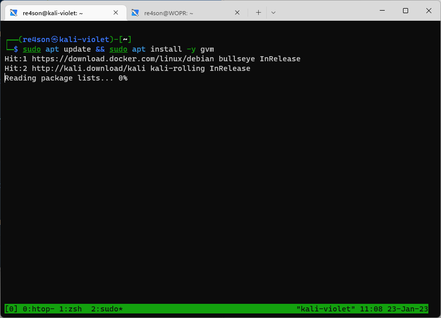
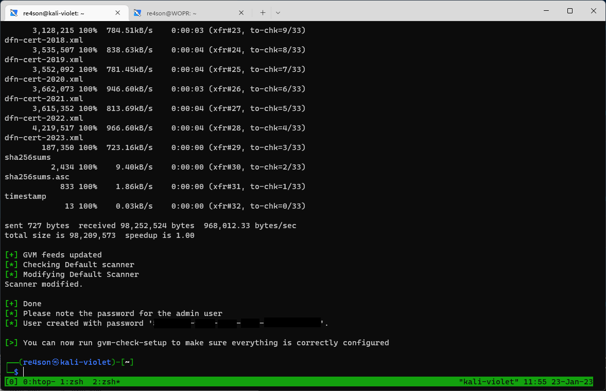
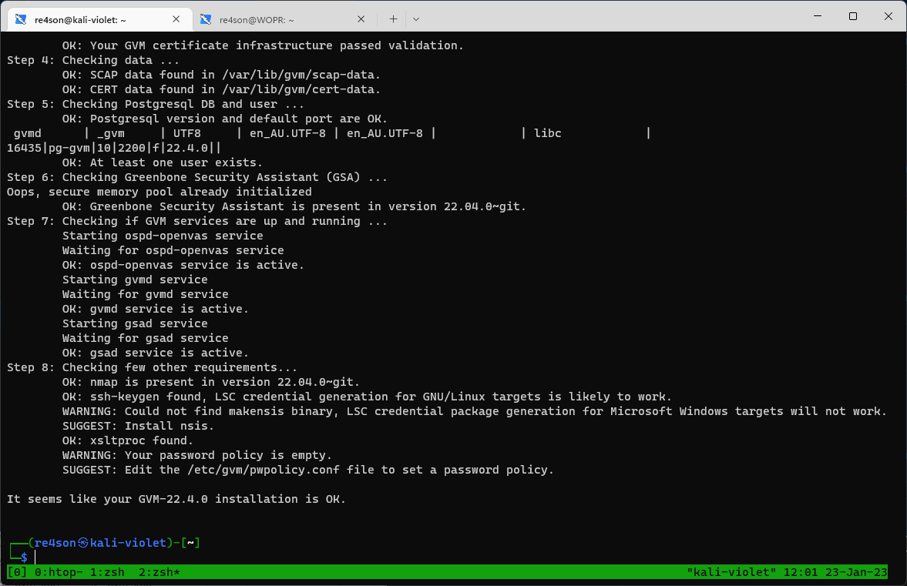
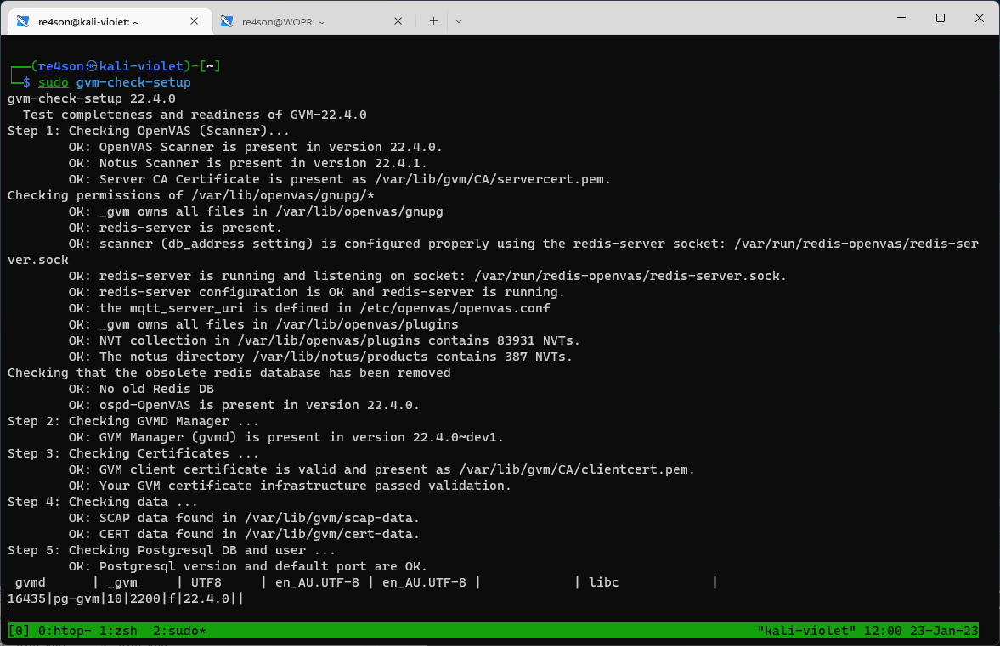
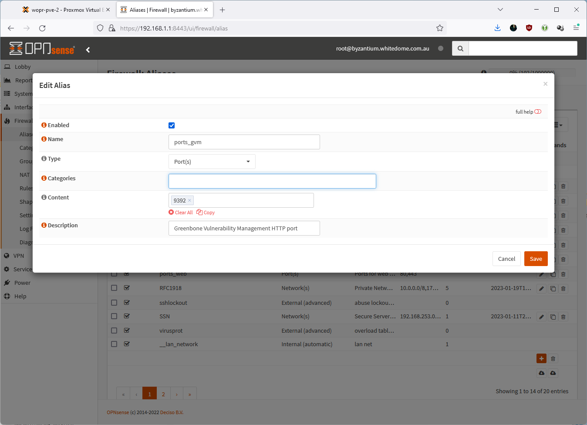
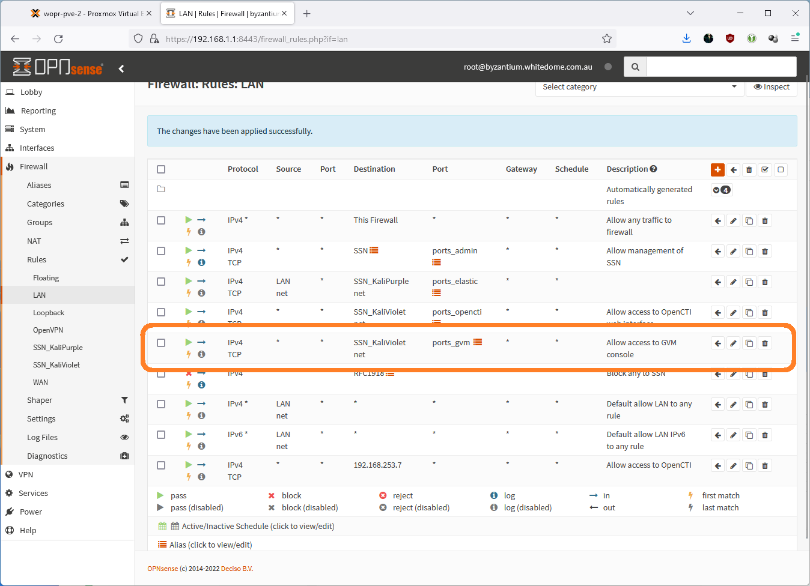
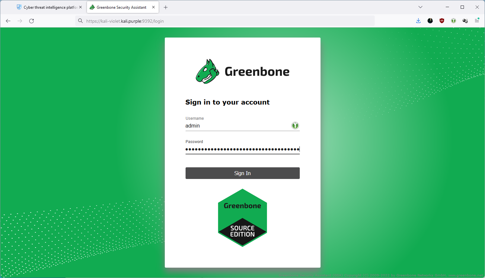
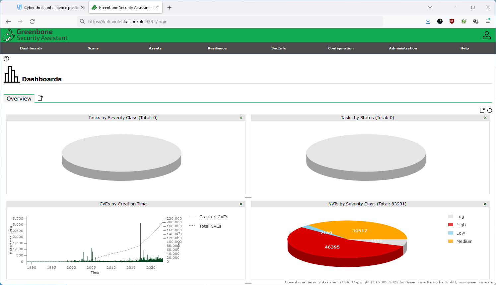

# Installation
# --------------
# Install Greenbone Vulnerability Scanner

~~~~~~~~~~~~~~~~~~~~~~~~~~~~~~~~~
sudo apt update && sudo apt install -y gvm
~~~~~~~~~~~~~~~~~~~~~~~~~~~~~~~~~
  

# Setup Greenbone Vulnerability Scanner

~~~~~~~~~~~~~~~~~~~~~~~~~~~~~~~~~
sudo gvm-setup
~~~~~~~~~~~~~~~~~~~~~~~~~~~~~~~~~

# This may take a while but be patient as the administrator password will be displayed at the end
  
  
# Check config:

~~~~~~~~~~~~~~~~~~~~~~~~~~~~~~~~~
sudo gvm-check-setup
~~~~~~~~~~~~~~~~~~~~~~~~~~~~~~~~~
  

# Make GVM available on external interface

~~~~~~~~~~~~~~~~~~~~~~~~~~~~~~~~~
sudo sed -e 's/127.0.0.1/0.0.0.0/g' -i /lib/systemd/system/gsad.service

sudo systemctl daemon-reload
sudo gvm-stop; sudo gvm-start
~~~~~~~~~~~~~~~~~~~~~~~~~~~~~~~~~

# Add firewall rule

  
  

# Logon to https://kali-violet.kali.purple:9392
  
  

Finished

 

