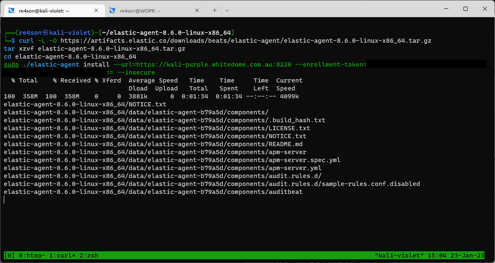

# Install dependencies
## Note: The Kali Purple Elastic Server must be operational at this stage  

~~~~~~~~~~~~~~~~~~~~~~~~~~~~~~~~~
sudo apt install -y rsyslog
~~~~~~~~~~~~~~~~~~~~~~~~~~~~~~~~~

# Create fleet policy
In Elastic, go to Management -> Fleet -> Agent policies
Click create agent policy
Create policy called “Linux Server Policy”
  

Click “Create agent policy”
Back in the overview, click on the newly created policy and click “Add integration”
  

Search for elastic agent and click add
  
  

When prompted, click on “Add elastic agent to your host”
  

Copy the content from the “Linux Tar” tab in section 3. Install Elastic Agent on your host"  
  

paste into the command line of Kali-Violet and add “--insecure” to the end before executing:
   

Answer “Y” when prompted.

Once installed, Eleastic will confirm successful enrollment and data ingestion:
   
 

Now you can open the "[Metrics System] Host overview" dashboard and select the new host to confirm data ingestion is working fine:
  

 
 
 
 Finished
 
 