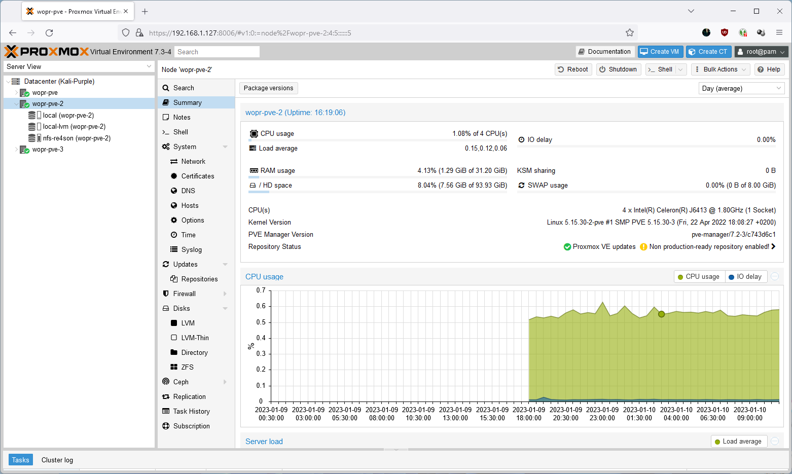
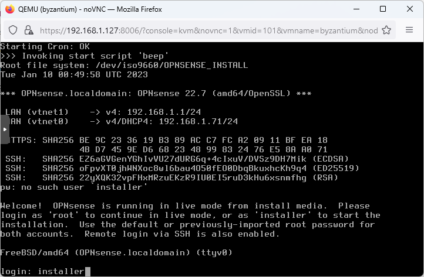
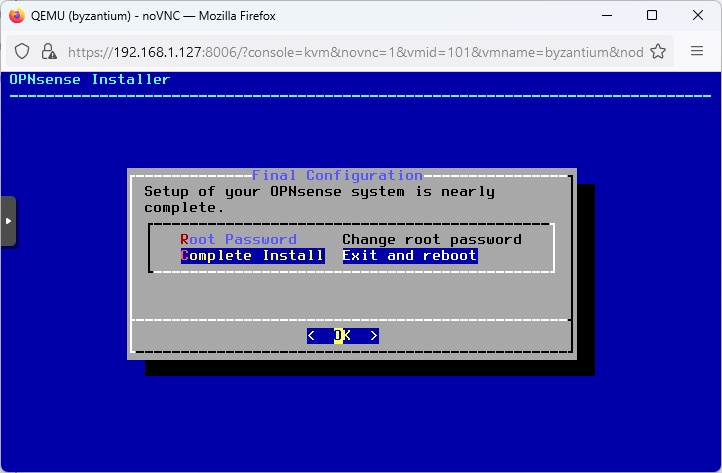
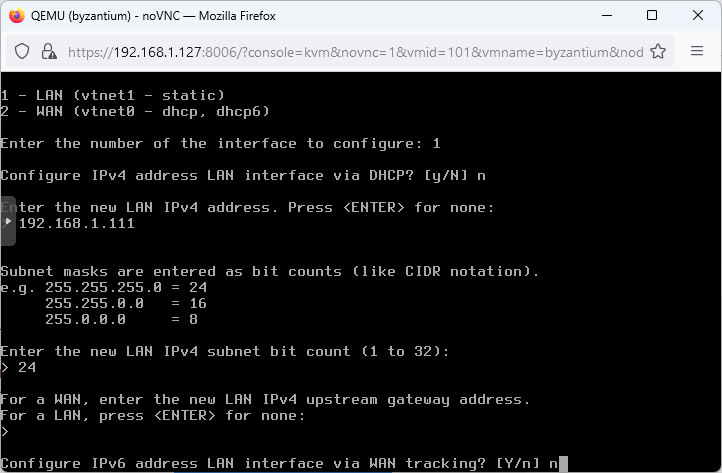

# Prerequisites
Running PVE  
[OPNSense DVD image](https://opnsense.org/download/)  
  
# Installation  
  
  
  
  
  
  
  
  
  
  
  
  
  
  
  
  
  
  
login: installer  
password: opnsense  
  
  
  
  
  
  
  
  
  
Configure LAN IP Address:  
  
  
  
  
  
  
  
  
  
  
  
  
  
Use https://dns.watch/ dns servers for best privacy:  
DNS servers:  
84.200.69.80  
84.200.70.40  
  
  
  
  
  
  
  
  
Enable serial console:  
-------------------------  
  
~~~~~~~~~~~~~~~~~~~~~~~~~~~~~~~~~
vi /boot/loader.conf
~~~~~~~~~~~~~~~~~~~~~~~~~~~~~~~~~

# Add:

~~~~~~~~~~~~~~~~~~~~~~~~~~~~~~~~~
## Add serial console for proxmox
boot_multicons="YES"
boot_serial="YES"
comconsole_speed="115200"
console="comconsole,vidconsole"
~~~~~~~~~~~~~~~~~~~~~~~~~~~~~~~~~
  
  

Finished
