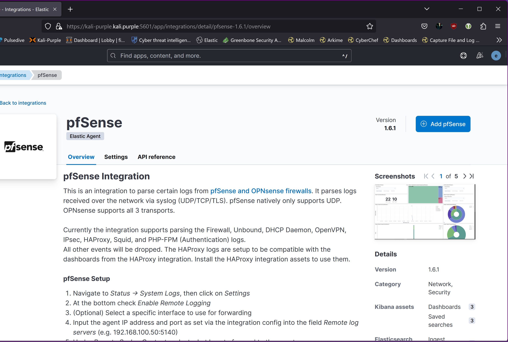

# Dependencies
## Note: The Kali Purple Elastic Server must be operational at this stage

# Installation  
### 1. Install pfsense integration on fleet server:
--------------------------------------------------------
In Kibana, go to  

   Fleet -> Agent policies -> Fleet Server Policy
   
     
   

Click “Add integration”
Search for pfsense and select
  

Click “Add pfsense”
  

Set “Syslog host” to “0.0.0.0”
  

Click “Save and continue”
  

Click “Save and deploy changes”
This will install the integration listening on UDP port 9001.
  

### 2. Configure OPNSense to send suslogs to kali-purple.kali.purple on UDP port 9001:
------------------------------------------------------------------------------------------------------------------

  
  
  
Data is now being ingested:  
  
