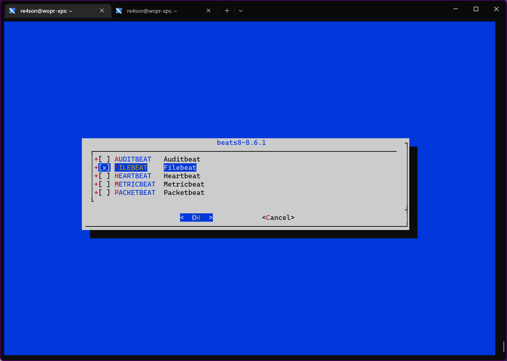
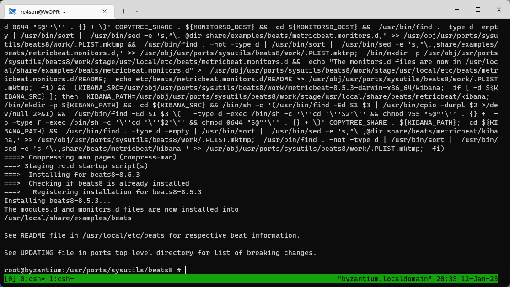

# Dependencies  
## Note: The Kali Purple Elastic Server must be operational at this stage
  
1. Copy Elastic root certificate across:
--------------------------------------------------
On kali-purple.kali.purple:

~~~~~~~~~~~~~~~~~~~~~~~~~~~~~~~~~
┌──(offsec㉿kali-purple)-[~]
└─$ sudo su

cd /etc/elasticsearch/certs
scp http_ca.crt root@byzantium.kali.purple:/etc/pki/root/

~~~~~~~~~~~~~~~~~~~~~~~~~~~~~~~~~

2. Install filebeat on byzantium:
--------------------------------------------
On byzantium.kali.purple:

~~~~~~~~~~~~~~~~~~~~~~~~~~~~~~~~~
opnsense-code ports
cd /usr/ports/sysutils/beats8
make install  
~~~~~~~~~~~~~~~~~~~~~~~~~~~~~~~~~

  
  

~~~~~~~~~~~~~~~~~~~~~~~~~~~~~~~~~
vi /usr/local/etc/beats/filebeat.yml

~~~~~~~~~~~~~~~~~~~~~~~~~~~~~~~~~

~~~~~~~~~~~~~~~~~~~~~~~~~~~~~~~~~
output.elasticsearch:
  # Array of hosts to connect to.
  hosts: ["kali-purple.kali.purple:9200"]

  # Protocol - either `http` (default) or `https`.
  protocol: "https"
  # List of root certificates for HTTPS server verifications
  ssl.certificate_authorities: ["/etc/pki/root/http_ca.crt"]

  # Authentication credentials - either API key or username/password.
  #api_key: "id:api_key"
  username: "elastic"
  password: "<secret>"
  
  
setup.kibana:

  # Kibana Host
  # Scheme and port can be left out and will be set to the default (http and 5601)
  # In case you specify and additional path, the scheme is required: http://localhost:5601/path
  # IPv6 addresses should always be defined as: https://[2001:db8::1]:5601
  host: "https://kali-purple.kali.purple:5601"
  ssl.verification_mode: none
~~~~~~~~~~~~~~~~~~~~~~~~~~~~~~~~~

~~~~~~~~~~~~~~~~~~~~~~~~~~~~~~~~~
cp /usr/local/share/examples/beats/filebeat.modules.d/suricata.yml.disabled /usr/local/etc/beats/filebeat.modules.d/
cp /usr/local/share/examples/beats/filebeat.modules.d/system.yml.disabled /usr/local/etc/beats/filebeat.modules.d/
cp /usr/local/share/examples/beats/filebeat.modules.d/nginx.yml.disabled /usr/local/etc/beats/filebeat.modules.d/
cd /usr/local/etc/beats/
filebeat modules list

> Enabled:
> 
> Disabled:
> suricata
> system

filebeat modules enable suricata nginx system
> Enabled suricata
> Enabled nginx
> Enabled system

filebeat modules list
> Enabled:
> suricata
> nginx
> system

> Disabled:
> squid
~~~~~~~~~~~~~~~~~~~~~~~~~~~~~~~~~

~~~~~~~~~~~~~~~~~~~~~~~~~~~~~~~~~
vi filebeat.modules.d/suricata.yml

# Module: suricata
# Docs: https://www.elastic.co/guide/en/beats/filebeat/7.17/filebeat-module-suricata.html

- module: suricata
  # All logs
  eve:
    enabled: true

    # Set custom paths for the log files. If left empty,
    # Filebeat will choose the paths depending on your OS.
    #var.paths:
~~~~~~~~~~~~~~~~~~~~~~~~~~~~~~~~~

~~~~~~~~~~~~~~~~~~~~~~~~~~~~~~~~~
filebeat test output -c /usr/local/etc/beats/filebeat.yml
filebeat test config -c /usr/local/etc/beats/filebeat.yml

filebeat setup -e
~~~~~~~~~~~~~~~~~~~~~~~~~~~~~~~~~

~~~~~~~~~~~~~~~~~~~~~~~~~~~~~~~~~
sysrc filebeat_enable="YES"
service filebeat start
~~~~~~~~~~~~~~~~~~~~~~~~~~~~~~~~~

Finished
