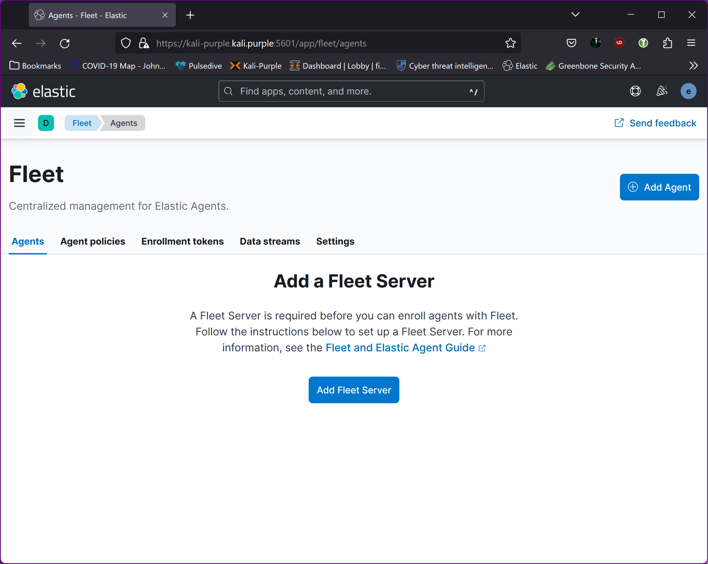
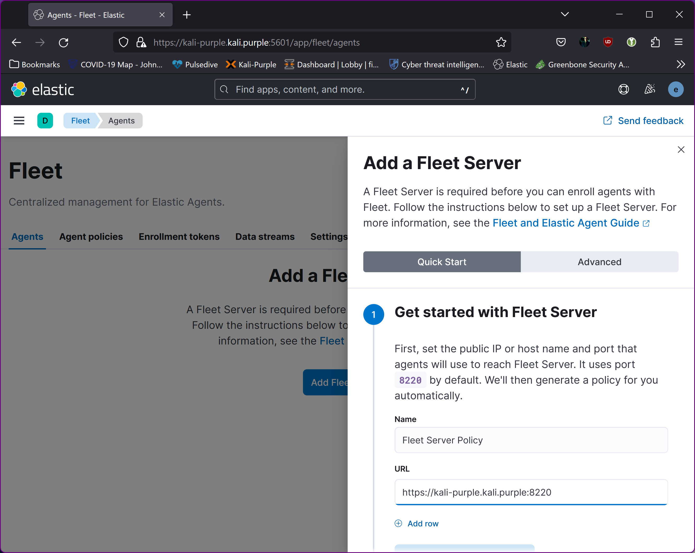
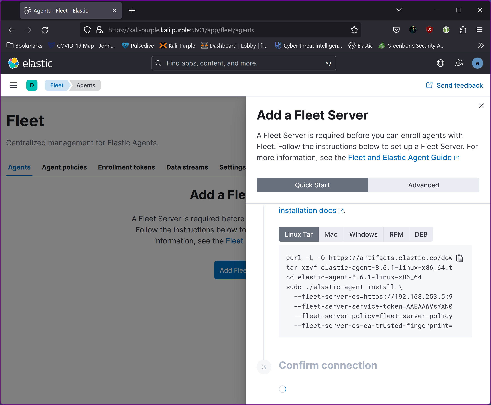
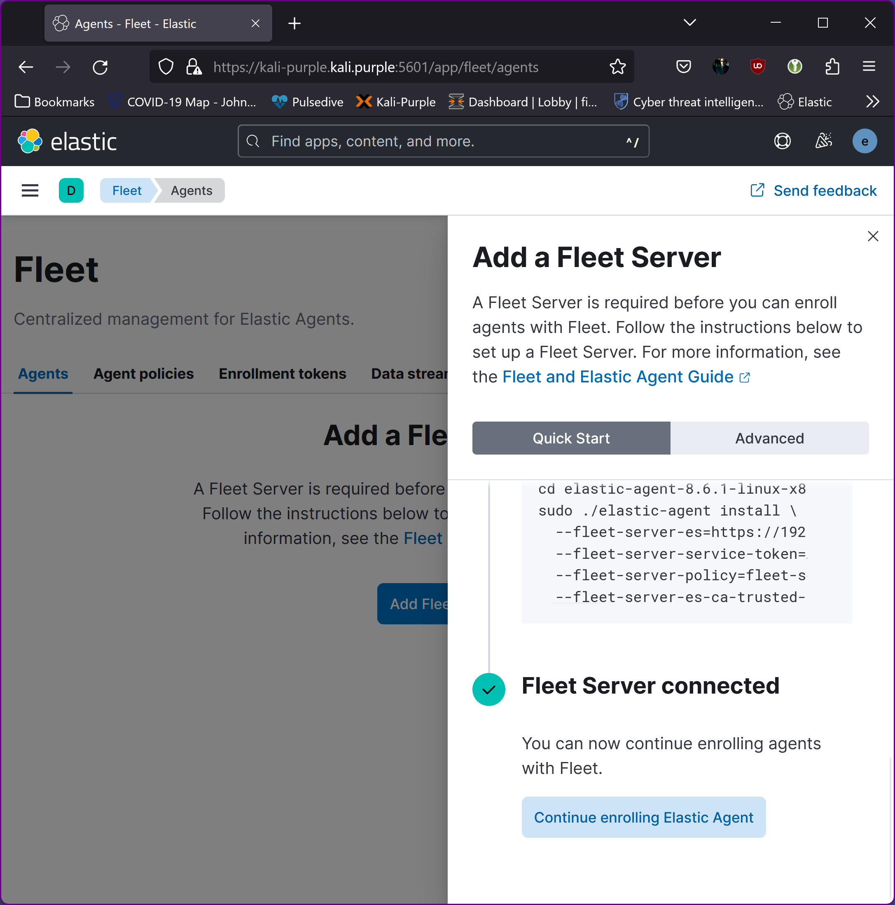
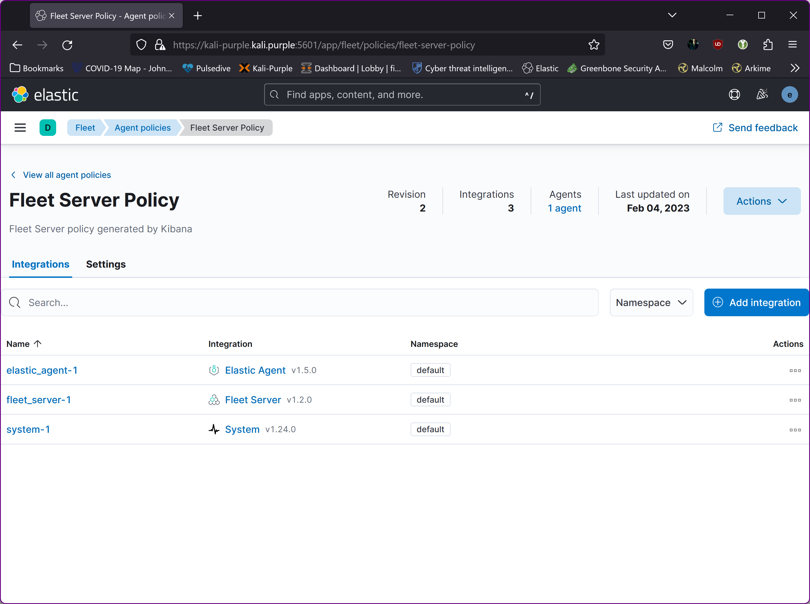

Install Fleet Server:
=====================
Goto fleet in Kibana
  

Click “Add Fleet Server” and follow instructions
  

Click “Continue” 

Install fleet server agent on kali-purple:
----------------------------------------------------

Copy the content from step “2”
  

and paste into your terminal session on kali-purple:

~~~~~~~~~~~~~~~~~~~~~~~~~~~~~~~~~
## Example:

cd ~
curl -L -O https://artifacts.elastic.co/downloads/beats/elastic-agent/elastic-agent-8.6.1-linux-x86_64.tar.gz
tar xzvf elastic-agent-8.6.1-linux-x86_64.tar.gz
cd elastic-agent-8.6.1-linux-x86_64
sudo ./elastic-agent install \
  --fleet-server-es=https://kali-purple.kali.purple:9200 \
  --fleet-server-service-token=AAEAAWVsYXN0aWMvZmxlZXQtc2VydmVEWSRva2VuLTE2NzM3NDQ5MjAKGPFORMRKRIHpRY3EwWk9DRWY2M3pLZw \
  --fleet-server-policy=fleet-server-policy \
  --fleet-server-es-ca-trusted-fingerprint=e515657dfb61ce3ee2452435345243525c8bce0b02692ba9c5b226dd525ca6d
~~~~~~~~~~~~~~~~~~~~~~~~~~~~~~~~~

~~~~~~~~~~~~~~~~~~~~~~~~~~~~~~~~~
┌──(root㉿kali-purple)-[~/elastic-agent-8.6.1-linux-x86_64]
└─# sudo ./elastic-agent install \
  --fleet-server-es=https://kali-purple.whitedome.com.au:9200 \
  --fleet-server-service-token=AAEAAWVsYXN0aWMvZmxlZXQtc2VydmVEWSRva2VuLTE2NzM3NDQ5MjAKGPFORMRKRIHpRY3EwWk9DRWY2M3pLZw \
  --fleet-server-policy=fleet-server-policy \
  --fleet-server-es-ca-trusted-fingerprint=e515657dfb61ce3ee240898feadf26d625c8bce0b02692ba9c5b226dd525ca6d
Elastic Agent will be installed at /opt/Elastic/Agent and will run as a service. Do you want to continue? [Y/n]:
{"log.level":"info","@timestamp":"2023-01-15T12:13:36.900+1100","log.origin":{"file.name":"cmd/enroll_cmd.go","file.line":407},"message":"Generating self-signed certificate for Fleet Server","ecs.version":"1.6.0"}
{"log.level":"info","@timestamp":"2023-01-15T12:13:39.736+1100","log.origin":{"file.name":"cmd/enroll_cmd.go","file.line":770},"message":"Waiting for Elastic Agent to start Fleet Server","ecs.version":"1.6.0"}
{"log.level":"info","@timestamp":"2023-01-15T12:14:39.748+1100","log.origin":{"file.name":"cmd/enroll_cmd.go","file.line":784},"message":"Fleet Server - Running on policy with Fleet Server integration: fleet-server-policy; missing config fleet.agent.id (expected during bootstrap process)","ecs.version":"1.6.0"}
{"log.level":"info","@timestamp":"2023-01-15T12:14:40.156+1100","log.origin":{"file.name":"cmd/enroll_cmd.go","file.line":475},"message":"Starting enrollment to URL: https://kali-purple:8220/","ecs.version":"1.6.0"}
{"log.level":"info","@timestamp":"2023-01-15T12:14:42.124+1100","log.origin":{"file.name":"cmd/enroll_cmd.go","file.line":273},"message":"Successfully triggered restart on running Elastic Agent.","ecs.version":"1.6.0"}
Successfully enrolled the Elastic Agent.
Elastic Agent has been successfully installed.

~~~~~~~~~~~~~~~~~~~~~~~~~~~~~~~~~

Wait for the Elastic Server to receive data:
  

Do not “Continue enrolling” at this stage. Just go back to the fleet server policy and add the integration “Elastic-Agent”.
  
