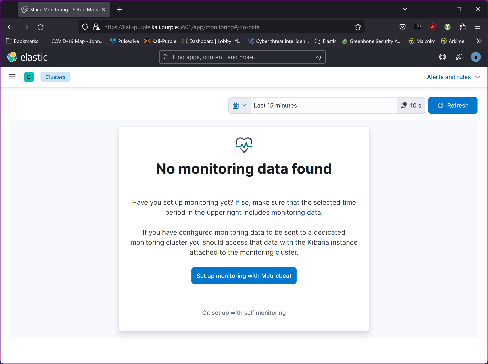
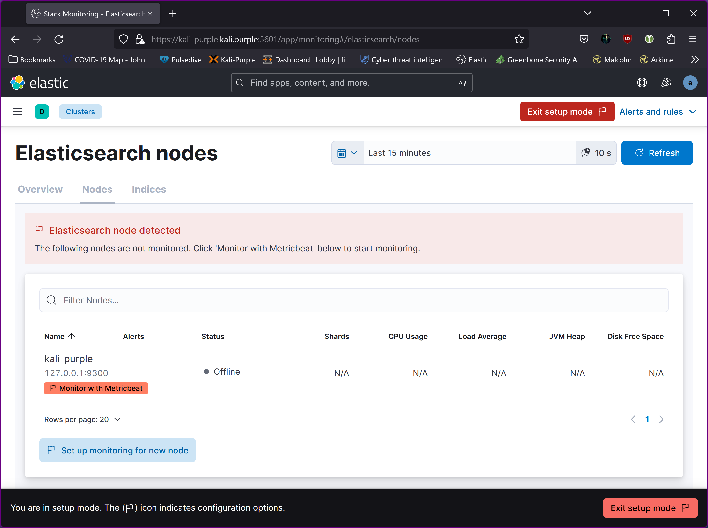
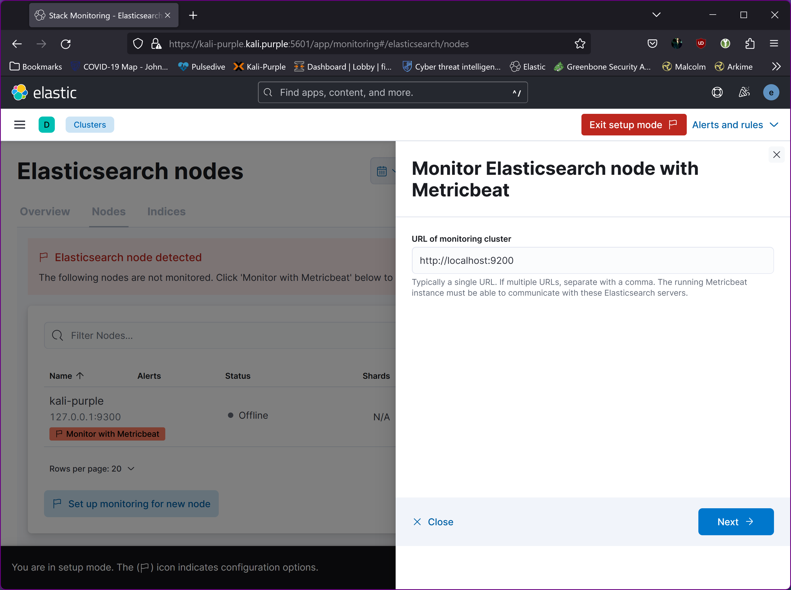
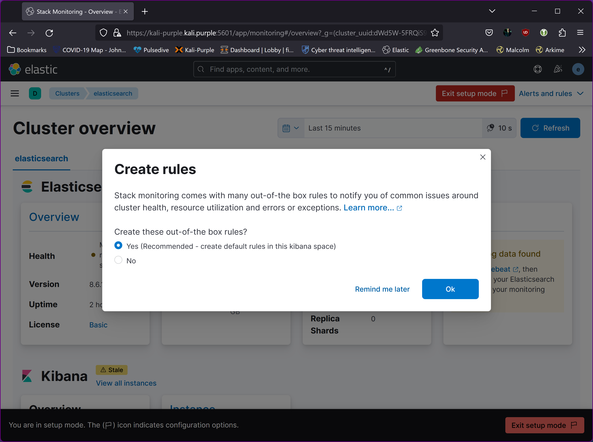
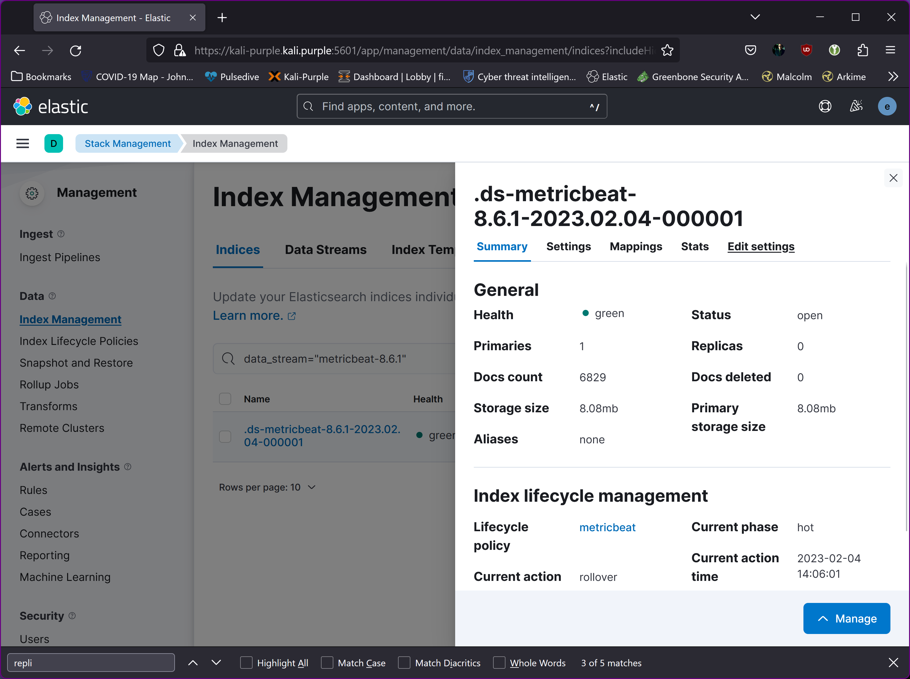
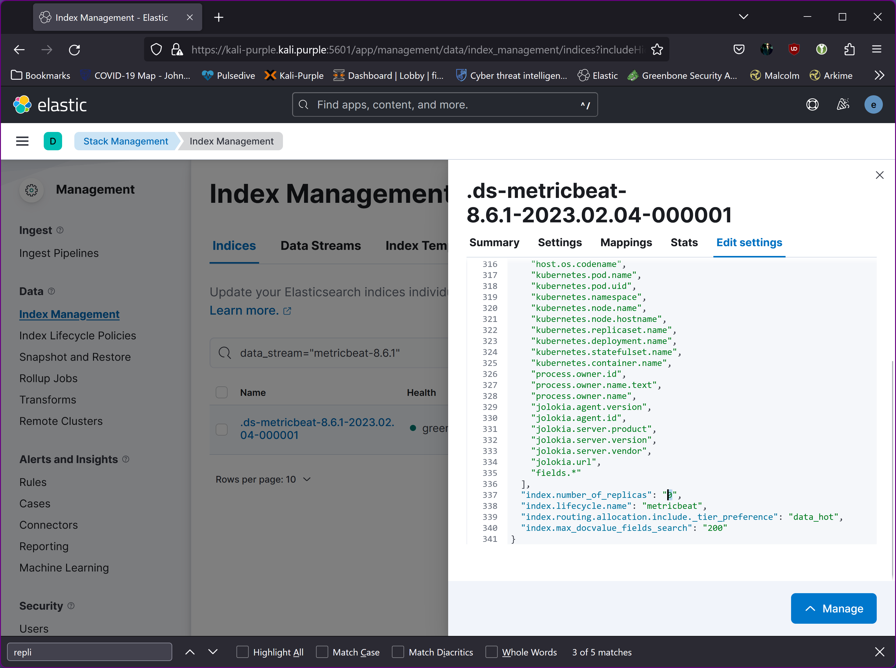
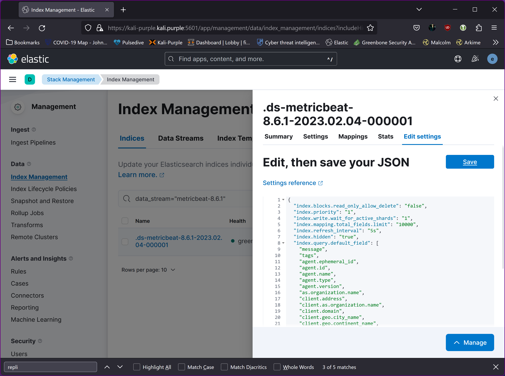

1. Install metric beat on Kali-Purple to collect Elasticsearch metrics

~~~~~~~~~~~~~~~~~~~~~~~~~~~~~~~~~
ssh <username>@kali-purple.kali.purple

cd ~
curl -L -O https://artifacts.elastic.co/downloads/beats/metricbeat/metricbeat-8.6.1-amd64.deb
sudo dpkg -i metricbeat-8.6.1-amd64.deb

# Edit the configuration

sudo vi /etc/metricbeat/metricbeat.yml
~~~~~~~~~~~~~~~~~~~~~~~~~~~~~~~~~

Modify /etc/metricbeat/metricbeat.yml to set the connection information:

~~~~~~~~~~~~~~~~~~~~~~~~~~~~~~~~~
output.elasticsearch:
  hosts: ["https://kali-purple.kali.purple"]
  username: "elastic"
  password: "<password>"
  # If using Elasticsearch's default certificate
  ssl.ca_trusted_fingerprint: "<es cert fingerprint>"

setup.kibana:
  host: "https://kali-purple.kali.purple"
  setup.kibana.ssl.enabled: true
  ssl.certificate_authorities: ["/etc/kibana/kibana-server_ca.crt"]
  setup.kibana.ssl.certificate: "/etc/kibana/kibana-server.crt"
  setup.kibana.ssl.key: "/etc/kibana/kibana-server.key"
~~~~~~~~~~~~~~~~~~~~~~~~~~~~~~~~~

To obtain the fingerprint, execute:

~~~~~~~~~~~~~~~~~~~~~~~~~~~~~~~~~
sudo openssl x509 -fingerprint -sha256 -noout -in /etc/elasticsearch/certs/http_ca.crt | awk 'BEGIN { FS = "=" } ; { print $2 }' | sed 's/://g'
~~~~~~~~~~~~~~~~~~~~~~~~~~~~~~~~~

2. Enable and configure the elasticsearch module

~~~~~~~~~~~~~~~~~~~~~~~~~~~~~~~~~
sudo metricbeat modules enable elasticsearch

sudo vi /etc/metricbeat/modules.d/elasticsearch.yml
~~~~~~~~~~~~~~~~~~~~~~~~~~~~~~~~~

Modify the settings in the /etc/metricbeat/modules.d/elasticsearch.yml file

~~~~~~~~~~~~~~~~~~~~~~~~~~~~~~~~~
# Module: elasticsearch
# Docs: https://www.elastic.co/guide/en/beats/metricbeat/main/metricbeat-module-elasticsearch.html

- module: elasticsearch
  #metricsets:
  #  - node
  #  - node_stats
  period: 10s
  hosts: ["https://kali-purple.kali.purple:9200"]
  username: "elastic"
  password: "secret"
~~~~~~~~~~~~~~~~~~~~~~~~~~~~~~~~~

3. Enable and configure the elasticsearch-xpack module

~~~~~~~~~~~~~~~~~~~~~~~~~~~~~~~~~
sudo metricbeat modules enable elasticsearch-xpack

sudo vi /etc/metricbeat/modules.d/elasticsearch-xpack.yml
~~~~~~~~~~~~~~~~~~~~~~~~~~~~~~~~~

Modify the settings in the /etc/metricbeat/modules.d/elasticsearch-xpack.yml file

~~~~~~~~~~~~~~~~~~~~~~~~~~~~~~~~~
# Module: elasticsearch
# Docs: https://www.elastic.co/guide/en/beats/metricbeat/main/metricbeat-module-elasticsearch.html

- module: elasticsearch
  xpack.enabled: true
  period: 10s
  hosts: ["https://kali-purple.kali.purple:9200"]
  protocol: "https"
  username: "elastic"
  password: "secret"
  ssl:
    enabled: true
    ca_trusted_fingerprint: "<es cert fingerprint>"
    verification_mode: "certificate"
~~~~~~~~~~~~~~~~~~~~~~~~~~~~~~~~~

Start Metricbeat
The setup command loads the Kibana dashboards. If the dashboards are already set up, omit this command.

~~~~~~~~~~~~~~~~~~~~~~~~~~~~~~~~~
sudo metricbeat test config
sudo metricbeat test modules
sudo metricbeat setup
sudo systemctl enable metricbeat --now
~~~~~~~~~~~~~~~~~~~~~~~~~~~~~~~~~

3. Enable Stack Monitoring in Kibana
  
  
  
  

Click "Yes"  
  
  
  
