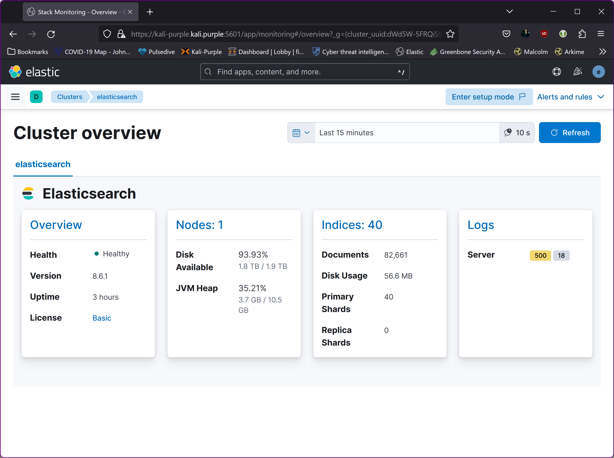

1. Install metric beat on Kali-Purple to collect Elasticsearch metrics

~~~~~~~~~~~~~~~~~~~~~~~~~~~~~~~~~
ssh <username>@kali-purple.kali.purple

cd ~
curl -L -O https://artifacts.elastic.co/downloads/beats/filebeat/filebeat-8.6.1-amd64.deb
sudo dpkg -i filebeat-8.6.1-amd64.deb

# Edit the configuration

sudo vi /etc/filebeat/filebeat.yml
~~~~~~~~~~~~~~~~~~~~~~~~~~~~~~~~~

Modify /etc/filebeat/filebeat.yml to set the connection information:

~~~~~~~~~~~~~~~~~~~~~~~~~~~~~~~~~
output.elasticsearch:
  hosts: ["https://kali-purple.kali.purple"]
  username: "elastic"
  password: "<password>"
  # If using Elasticsearch's default certificate
  ssl.ca_trusted_fingerprint: "<es cert fingerprint>"

setup.kibana:
  host: "https://kali-purple.kali.purple"
  setup.kibana.ssl.enabled: true
  ssl.certificate_authorities: ["/etc/kibana/kibana-server_ca.crt"]
  setup.kibana.ssl.certificate: "/etc/kibana/kibana-server.crt"
  setup.kibana.ssl.key: "/etc/kibana/kibana-server.key"
~~~~~~~~~~~~~~~~~~~~~~~~~~~~~~~~~

To obtain the fingerprint, execute:

~~~~~~~~~~~~~~~~~~~~~~~~~~~~~~~~~
sudo openssl x509 -fingerprint -sha256 -noout -in /etc/elasticsearch/certs/http_ca.crt | awk 'BEGIN { FS = "=" } ; { print $2 }' | sed 's/://g'
~~~~~~~~~~~~~~~~~~~~~~~~~~~~~~~~~

2. Enable and configure the elasticsearch module

~~~~~~~~~~~~~~~~~~~~~~~~~~~~~~~~~
sudo filebeat modules enable elasticsearch

sudo vi /etc/filebeat/modules.d/elasticsearch.yml
~~~~~~~~~~~~~~~~~~~~~~~~~~~~~~~~~

Modify the settings in the /etc/filebeat/modules.d/elasticsearch.yml file

~~~~~~~~~~~~~~~~~~~~~~~~~~~~~~~~~
# Module: elasticsearch
# Docs: https://www.elastic.co/guide/en/beats/filebeat/main/filebeat-module-elasticsearch.html

- module: elasticsearch
  # Server log
  server:
    enabled: true

    # Set custom paths for the log files. If left empty,
    # Filebeat will choose the paths depending on your OS.
    #var.paths:

  gc:
    enabled: true
    # Set custom paths for the log files. If left empty,
    # Filebeat will choose the paths depending on your OS.
    #var.paths:

  audit:
    enabled: true
    # Set custom paths for the log files. If left empty,
    # Filebeat will choose the paths depending on your OS.
    #var.paths:

  slowlog:
    enabled: true
    # Set custom paths for the log files. If left empty,
    # Filebeat will choose the paths depending on your OS.
    #var.paths:

  deprecation:
    enabled: true
    # Set custom paths for the log files. If left empty,
    # Filebeat will choose the paths depending on your OS.
    #var.paths:
~~~~~~~~~~~~~~~~~~~~~~~~~~~~~~~~~

Start Filebeat
The setup command loads the Kibana dashboards. If the dashboards are already set up, omit this command.

~~~~~~~~~~~~~~~~~~~~~~~~~~~~~~~~~
sudo filebeat setup
sudo systemctl enable filebeat --now
~~~~~~~~~~~~~~~~~~~~~~~~~~~~~~~~~

3. Disabling warning “ Missing replica shards”

Goto “Dev Tools” in Kibana and run

~~~~~~~~~~~~~~~~~~~~~~~~~~~~~~~~~
PUT _settings
{
  "number_of_replicas": 0
}
~~~~~~~~~~~~~~~~~~~~~~~~~~~~~~~~~

  
  

Make sure it is all working:  
  

Done.