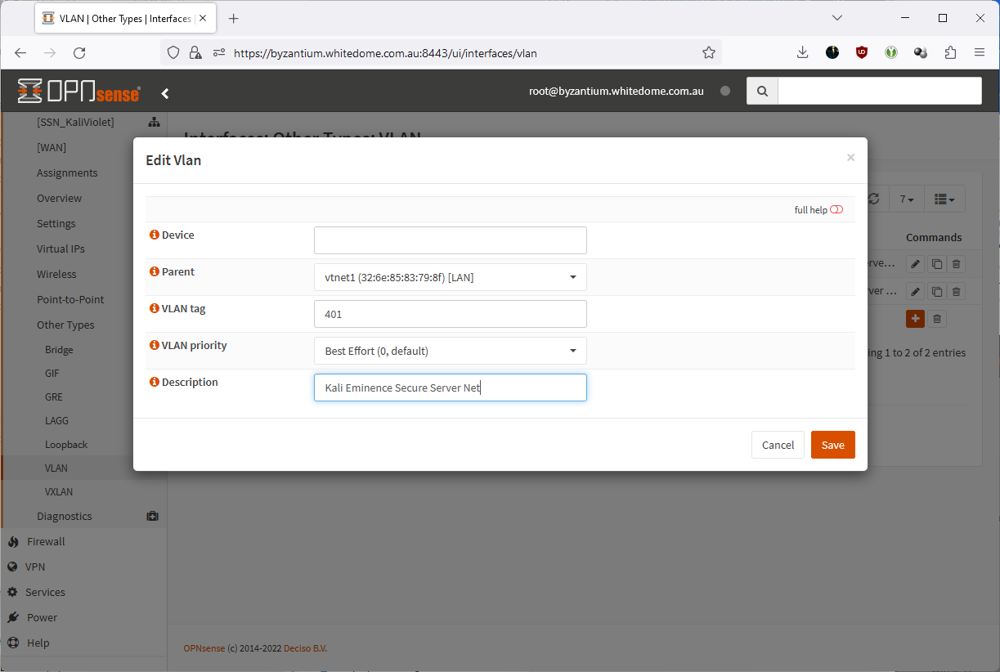

# Prerequisites
[Kali Purple installation medium](https://www.kali.org/get-kali/)  
  
# Installation

Create Secure Server VLAN
  
  
  
  
  
  
  
  
  
  
  
  
  
Forgot to enter the name previously, so let's do that now:  
  

Enable serial console:  
  

Install Kali Purple:

  
  
  
  
  
  
  
  
  
Enable ssh for remote administration:  
--------------------------------------------  

~~~~~~~~~~~~~~~~~~~~~~~~~~~~~~~~~
sudo systemctl enable ssh --now
~~~~~~~~~~~~~~~~~~~~~~~~~~~~~~~~~

Install xrdp for remote administration:
---------------------------------------------

~~~~~~~~~~~~~~~~~~~~~~~~~~~~~~~~~
sudo apt update && sudo apt install xrdp
~~~~~~~~~~~~~~~~~~~~~~~~~~~~~~~~~
  

~~~~~~~~~~~~~~~~~~~~~~~~~~~~~~~~~
sudo systemctl enable xrdp --now
~~~~~~~~~~~~~~~~~~~~~~~~~~~~~~~~~

  

Fix xrdp error message on login:
  

~~~~~~~~~~~~~~~~~~~~~~~~~~~~~~~~~
sudo wget -P /etc/polkit-1/localauthority/50-local.d https://gitlab.com/kalilinux/documentation/kali-purple/-/raw/main/401_kali-eminence/overlays/etc/polkit-1/localauthority/50-local.d/45-allow-colord.pkla
~~~~~~~~~~~~~~~~~~~~~~~~~~~~~~~~~

  

Enable serial console:
-------------------------

~~~~~~~~~~~~~~~~~~~~~~~~~~~~~~~~~
sudo vi /etc/default/grub ##Add:

## Kali Purple: Enable serial console
GRUB_CMDLINE_LINUX_DEFAULT="quiet console=ttyS0,115200n8 console=tty1"
GRUB_TERMINAL="serial console"
GRUB_SERIAL_COMMAND="serial --speed=115200 --unit=0 --word=8 --parity=no --stop=1"
~~~~~~~~~~~~~~~~~~~~~~~~~~~~~~~~~
  

~~~~~~~~~~~~~~~~~~~~~~~~~~~~~~~~~
sudo update-grub
~~~~~~~~~~~~~~~~~~~~~~~~~~~~~~~~~

  
  

Finished