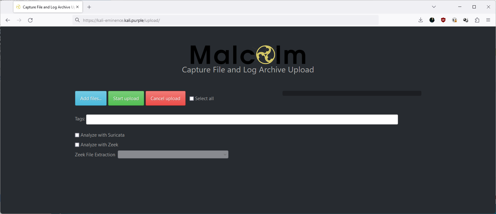

# Install dependencies:
#----------------------

~~~~~~~~~~~~~~~~~~~~~~~~~~~~~~~~~
sudo apt update && sudo apt full-upgrade
sudo apt install xrdp nginx apache2-utils python3-pip python3-requests python3-dialog curl apt-transport-https gnupg-agent software-properties-common docker.io docker-compose
sudo systemctl enable docker --now
~~~~~~~~~~~~~~~~~~~~~~~~~~~~~~~~~

## Download and install Malcolm:
--------------------------------

~~~~~~~~~~~~~~~~~~~~~~~~~~~~~~~~~
cd ~
git clone https://github.com/cisagov/Malcolm
cd Malcolm
sudo ./scripts/install.py
~~~~~~~~~~~~~~~~~~~~~~~~~~~~~~~~~

Add a non-root user to the "docker" group?: y   

Enter user account: offsec

Add another non-root user to the "docker" group?: n

fs.file-max increases allowed maximum for file handles
fs.file-max= appears to be missing from /etc/sysctl.conf, append it? (Y/n): y

fs.inotify.max_user_watches increases allowed maximum for monitored files
fs.inotify.max_user_watches= appears to be missing from /etc/sysctl.conf, append it? (Y/n): y

fs.inotify.max_queued_events increases queue size for monitored files
fs.inotify.max_queued_events= appears to be missing from /etc/sysctl.conf, append it? (Y/n): y

fs.inotify.max_user_instances increases allowed maximum monitor file watchers
fs.inotify.max_user_instances= appears to be missing from /etc/sysctl.conf, append it? (Y/n): y

vm.max_map_count increases allowed maximum for memory segments
vm.max_map_count= appears to be missing from /etc/sysctl.conf, append it? (Y/n): y

net.core.somaxconn increases allowed maximum for socket connections
net.core.somaxconn= appears to be missing from /etc/sysctl.conf, append it? (Y/n): y

vm.swappiness adjusts the preference of the system to swap vs. drop runtime memory pages
vm.swappiness= appears to be missing from /etc/sysctl.conf, append it? (Y/n): y

vm.dirty_background_ratio defines the percentage of system memory fillable with "dirty" pages before flushing
vm.dirty_background_ratio= appears to be missing from /etc/sysctl.conf, append it? (Y/n): y

vm.dirty_ratio defines the maximum percentage of dirty system memory before committing everything
vm.dirty_ratio= appears to be missing from /etc/sysctl.conf, append it? (Y/n): y

/etc/security/limits.d/limits.conf increases the allowed maximums for file handles and memlocked segments
/etc/security/limits.d/limits.conf does not exist, create it? (Y/n): y

## Configure Malcolm:
--------------------------------

./scripts/install.py --configure

Malcolm processes will run as UID 1000 and GID 1000. Is this OK? (Y/n): y

Should Malcolm use and maintain its own OpenSearch instance? (Y/n): y

Forward Logstash logs to a secondary remote OpenSearch instance? (y/N): n

Setting 4g for OpenSearch and 2.5g for Logstash. Is this OK? (Y/n): y

Setting 3 workers for Logstash pipelines. Is this OK? (Y/n): y

Restart Malcolm upon system or Docker daemon restart? (y/N): y
1: no
2: on-failure
3: always
4: unless-stopped
Select Malcolm restart behavior (unless-stopped): 4

Require encrypted HTTPS connections? (Y/n): y

Will Malcolm be running behind another reverse proxy (Traefik, Caddy, etc.)? (y/N): n

Specify external Docker network name (or leave blank for default networking) (): 

Authenticate against Lightweight Directory Access Protocol (LDAP) server? (y/N): n

Store PCAP, log and index files locally under /home/user/Malcolm? (Y/n): y

Compress OpenSearch index snapshots? (y/N): n

Delete the oldest indices when the database exceeds a certain size? (y/N): n

Automatically analyze all PCAP files with Suricata? (Y/n): y

Download updated Suricata signatures periodically? (y/N): y

Automatically analyze all PCAP files with Zeek? (Y/n): y

Perform reverse DNS lookup locally for source and destination IP addresses in logs? (y/N): n

Perform hardware vendor OUI lookups for MAC addresses? (Y/n): y

Perform string randomness scoring on some fields? (Y/n): y

Expose OpenSearch port to external hosts? (y/N): y

Expose Logstash port to external hosts? (y/N): y

Expose Filebeat TCP port to external hosts? (y/N): y
1: json
2: raw
Select log format for messages sent to Filebeat TCP listener (json): 1

Source field to parse for messages sent to Filebeat TCP listener (message): message

Target field under which to store decoded JSON fields for messages sent to Filebeat TCP listener (miscbeat): miscbeat

Field to drop from events sent to Filebeat TCP listener (message): message

Tag to apply to messages sent to Filebeat TCP listener (_malcolm_beats): _malcolm_beats

Expose SFTP server (for PCAP upload) to external hosts? (y/N): y

Enable file extraction with Zeek? (y/N): y
1: none
2: known
3: mapped
4: all
5: interesting
Select file extraction behavior (none): 5
1: quarantined
2: all
3: none
Select file preservation behavior (quarantined): 1

Expose web interface for downloading preserved files? (y/N): y

Enter AES-256-CBC encryption password for downloaded preserved files (or leave blank for unencrypted): offsec

Scan extracted files with ClamAV? (y/N): y

Scan extracted files with Yara? (y/N): y

Scan extracted PE files with Capa? (y/N): y

Lookup extracted file hashes with VirusTotal? (y/N): n

Download updated file scanner signatures periodically? (n/Y): y

Should Malcolm run and maintain an instance of NetBox, an infrastructure resource modeling tool? (y/N): y

Sshould Malcolm enrich network traffic using NetBox? (Y/n): y

Should Malcolm capture live network traffic to PCAP files for analysis with Arkime? (y/N): y

Capture packets using netsniff-ng? (Y/n): y   

Capture packets using tcpdump? (y/N): n

Should Arkime delete PCAP files based on available storage (see https://arkime.com/faq#pcap-deletion)? (y/N): y

Should Malcolm analyze live network traffic with Suricata? (y/N): y

Should Malcolm analyze live network traffic with Zeek? (y/N): y

Specify capture interface(s) (comma-separated): eth0

Capture filter (tcpdump-like filter expression; leave blank to capture all traffic) (): not port 5044 and not port 8005 and not port 9200

Disable capture interface hardware offloading and adjust ring buffer sizes? (y/N): n

Malcolm has been installed to /home/user/Malcolm. See README.md for more information.
Scripts for starting and stopping Malcolm and changing authentication-related settings can be found in /home/user/Malcolm/scripts.

sudo reboot

## Configure Malcolm - cont.:
--------------------------------
cd ~/Malcolm
./scripts/auth_setup

Store administrator username/password for local Malcolm access? (Y/n): y

Administrator username: offsec
analyst password:
analyst password (again):

(Re)generate self-signed certificates for HTTPS access (Y/n): y 

(Re)generate self-signed certificates for a remote log forwarder (Y/n): y

Store username/password for primary remote OpenSearch instance? (y/N): n

Store username/password for secondary remote OpenSearch instance? (y/N): n

Store username/password for email alert sender account? (y/N): n

(Re)generate internal passwords for NetBox (Y/n): y

## Download docker images:
--------------------------------

docker-compose pull
  

docker images  
  

## Start Malcolm (will take >5mins):
------------------------------------
./scripts/start

Navigate to https://kali-eminence.kali.purple/readme for an introduction to Malcolm
  

# Install portainer for container management:

docker volume create portainer_data
docker run -d -p 8000:8000 -p 9443:9443 --name portainer --restart=always -v /var/run/docker.sock:/var/run/docker.sock -v portainer_data:/data portainer/portainer-ce:latest

Point your browser to https://kali-eminence.whitedome.com.au:9443/#!/2/docker/containers to access Portainer:
  

Tip: Stop or pause the containers 'malcolm_pcap-capture_1", “malcolm_surricata-live_1” and malcolm_zeek-live_1" when you don't want any live capture (probably 99% of the time), so it won't clutter your system

# Malcolm components
# =============
# Links:

|                                  Component                                 |                              Link                                                      |
| Arkime | https://kali-eminence.kali.purple/ |
| OpenSearch Dashboards | https://kali-eminence.kali.purple/dashboards/ |
| Capture File and Log Archive Upload (Web) | https://kali-eminence.kali.purple/upload/ |
| Capture File and Log Archive Upload (SFTP) | sftp://<username>@kali-eminence.kali.purple:8022/files |
| Host and Subnet Name Mapping Editor | https://kali-eminence.kali.purple/name-map-ui/ |
| NetBox | https://kali-eminence.kali.purple/netbox/ |
| Cyberchef | https://kali-eminence.kali.purple/cyberchef/ |
| Documentation | https://kali-eminence.kali.purple/readme/ |
| Account Management | https://https://kali-eminence.kali.purple:488 |

  
  
  
  
  
  
  
  

Finished
