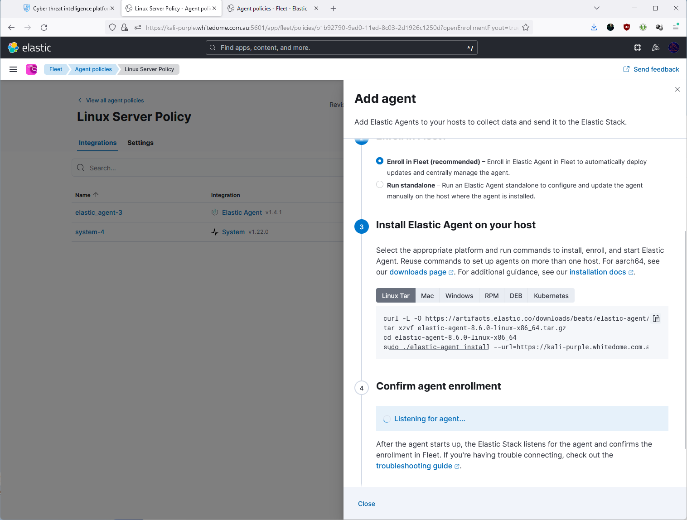
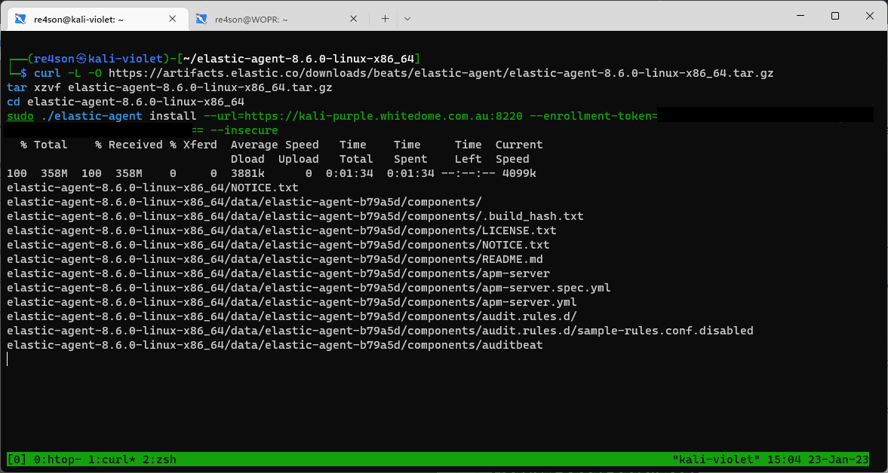
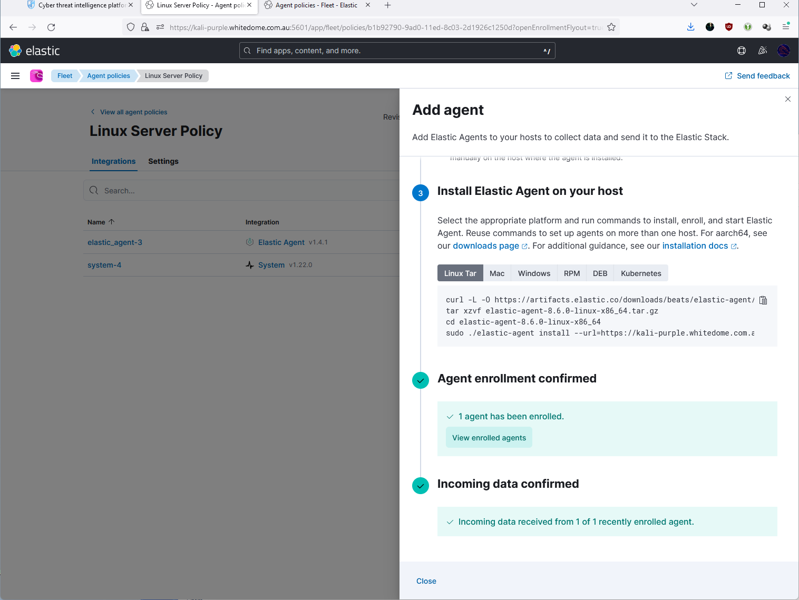
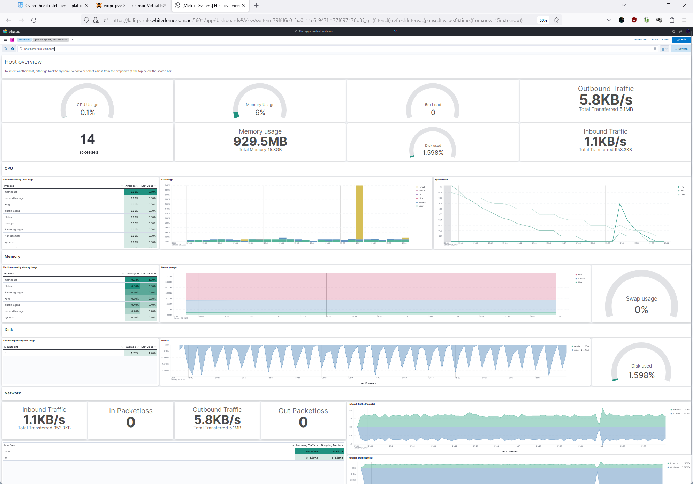

# Dependencies
## Note: The Kali Purple Elastic Server must be operational at this stage
  
# Installation  
### Install dependencies

~~~~~~~~~~~~~~~~~~~~~~~~~~~~~~~~~
sudo apt install -y rsyslog
~~~~~~~~~~~~~~~~~~~~~~~~~~~~~~~~~

# Create agent policy
In Elastic, go to Management -> Fleet -> Agent policies
Select “Linux Server Policy” and click “Add Agent”
  

Copy the content from the “Linux Tar” tab in section 3. Install Elastic Agent on your host" and
paste into the command line of Kali-Eminence and add “--insecure” to the end before executing:
  

Answer “Y” when prompted.

Once installed, Eleastic will confirm successful enrollment and data ingestion:
   
 

Now you can open the "[Metrics System] Host overview" dashboard and select the new host to confirm data ingestion is working fine:
  

 
  
 Finished
 
 