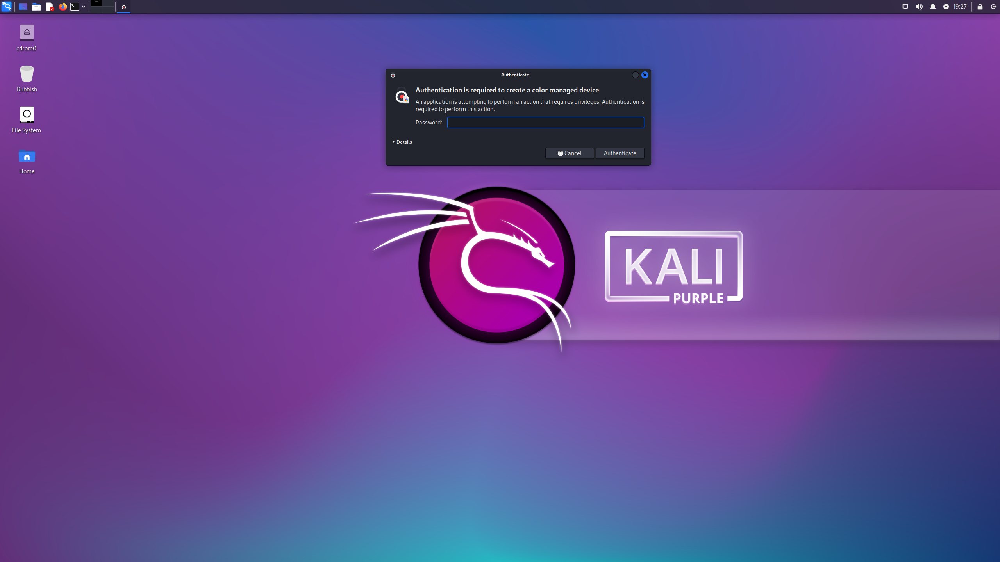

# Prerequisites
[Kali Purple installation medium](https://www.kali.org/get-kali/), or  
[Kali Linux installation medium](https://www.kali.org/get-kali/)  
  
# Installation 
## 1. Create VM
  
  
  
  
  
  
  
  
  
  
  
Standard Kali Linux or Kali Purple installation

Enable ssh for remote administration:
--------------------------------------------

~~~~~~~~~~~~~~~~~~~~~~~~~~~~~~~~~
sudo systemctl enable ssh --now
~~~~~~~~~~~~~~~~~~~~~~~~~~~~~~~~~
  

Install xrdp for remote administration:
---------------------------------------------

~~~~~~~~~~~~~~~~~~~~~~~~~~~~~~~~~
sudo apt update && sudo apt install xrdp
~~~~~~~~~~~~~~~~~~~~~~~~~~~~~~~~~
  

~~~~~~~~~~~~~~~~~~~~~~~~~~~~~~~~~
sudo systemctl enable xrdp --now
~~~~~~~~~~~~~~~~~~~~~~~~~~~~~~~~~
  

Fix xrdp error message on login:
  

~~~~~~~~~~~~~~~~~~~~~~~~~~~~~~~~~
sudo wget -P /etc/polkit-1/localauthority/50-local.d https://gitlab.com/kalilinux/documentation/kali-purple/-/raw/main/1001_kali-heliotrope/overlays/etc/polkit-1/localauthority/50-local.d/45-allow-colord.pkla
~~~~~~~~~~~~~~~~~~~~~~~~~~~~~~~~~
  

Finished