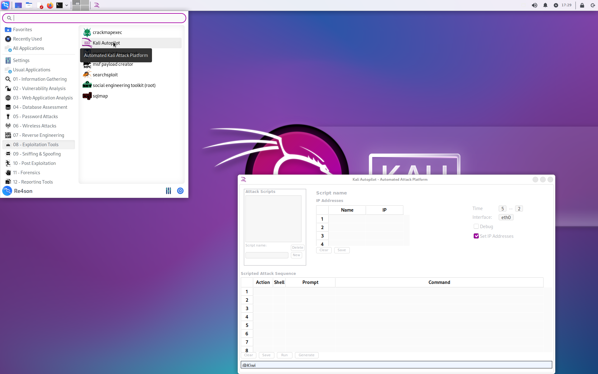

Kali Autopilot is an attack automation framework to support cyber security research, training, challenge labs and CTF events.  
It is commonly used by cyber defense analysts and cyber infrastructure support specialists to simulate the actions of attackers in order to validate and improve prevention, detection and alerting capabilities.  
It is also useful to automate repetitive tasks of a penetration test.  
  
## Install Kali Autopilot:

sudo apt install kali-autopilot

## Usage:
You can launch Kali Autopilot via the app menu under:

08 - Exploitation Tools -> Kali Autopilot  

  
  
## User Guide
  
The user guide can be found in the dedicated [Kali Autopilot Wiki](https://gitlab.com/re4son/kali-autopilot/-/wikis/home)  
