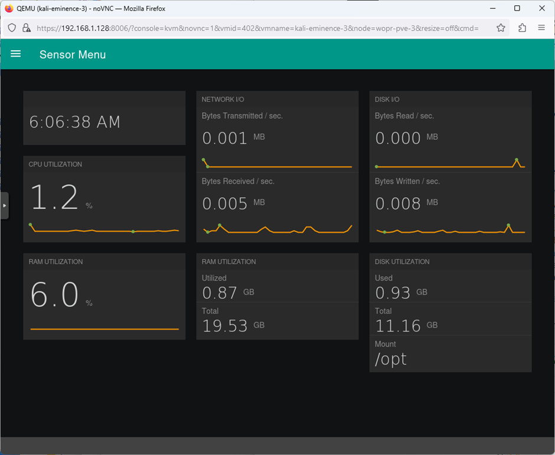
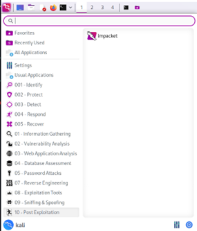
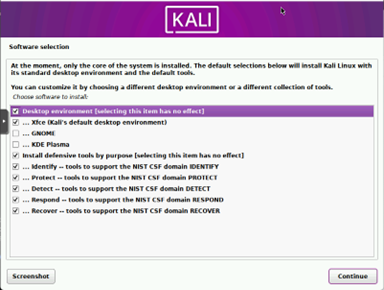
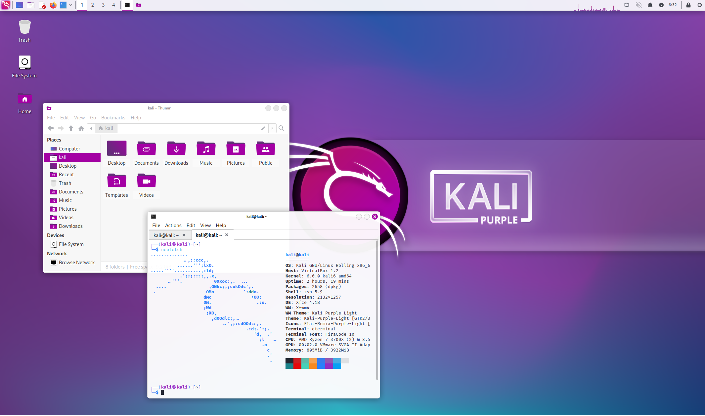
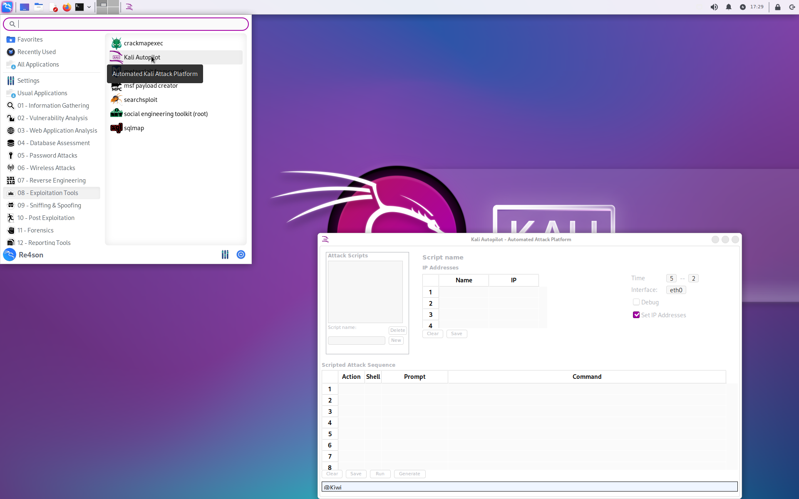

# KALI PURPLE - LEVELING THE PLAYING FIELD

## We are making enterprise grade security accessible

### What is Kali Purple?

Kali Purple started out as a proof of concept, evolved into a framework, then a platform, and now it has become so big that we don't even have a word for it anymore so why don't we just call it a movement.  
A movement to make enterprise grade security accessible to everyone.  
  
Remember what we did a decade ago with Kali Linux?  
Or with Backtrack before that?  
We made offensive security accessible to everyone. No expensive licenses required, no need for commercial grade infrastructure, no writing code or compiling tools to make it all work...  
Just download Kali Linux and do your thing.  
  
We are excited to start a new journey with the mission to do exactly the same for defensive security:  
We are making defensive security accessible to everyone. No expensive licenses required, no need for commercial grade infrastructure, no writing code or compiling from source to make it all work...  
Just download Kali Purple and do your thing.  

   
On a high level, Kali Purple consists of:
  
- Over 100 defensive tools, such as:
  - Arkime full packet capture
  - Cyberchef
  - Elasticsearch SIEM
  - GVM vulnerability scanner
  - TheHive incident response platform
  - Malcolm
  - Suricata IDS
  - Zeek IDS
  - and of course all the usual Kali tools
- ISOs:
  - [Kali Purple](https://www.kali.org/get-kali/)
  - [Malcolm - based on Kali](https://build.nethunter.com/contributors/re4son/kali-purple/)
  - [Hedgehog - based on Kali](https://build.nethunter.com/contributors/re4son/kali-purple/)
- A defensive menu structure according to NIST CSF:
  - Identify
  - Protect
  - Detect
  - Respond
  - Recover
- A gorgeous wallpaper and theme
- A reference architecture for the ultimate SOC In-A-Box; perfect for:
  - Learning
  - Practicing SOC analysis and threat hunting
  - Security control design and testing
  - Blue / Red / Purple teaming exercises 
  - Kali spy vs. spy competitions ( bare knuckle Blue vs. Red )
- Kali Autopilot - an attack script builder / framework for automated attacks
- Defensive tools documentations
- Wiki
- Kali Purple Hub for the community to share:
  - Practice pcaps
  - Kali Autopilot scripts for blue teaming exercises
- Kali Purple Discord channels for community collaboration and fun
  
And this is just the beginning of our journey.
  
### This is what it looks like:

#### Some defensive tools:
  
##### Elastic SIEM:

  
##### Arkime:

  
##### Malcolm:

  
##### Hedgehog:

#### Menu, installer, and theme:

 

  
#### Kali Autopilot

#### Kali Purple SOC In-A-Box Reference Architecture

## Contributing

Kali-Purple is a community project.  
We appreciate all and any contribution to make Kali-Purple the most comprehensive SOC-in-a-box solution and lab environment in the world.  
